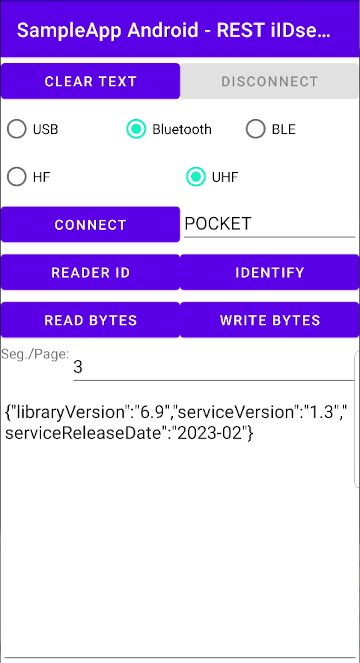

# RESTful Java DOC sample code for RFID transponders
This sample code is for handling both HF and UHF transponders on Android devices using a Micro-Sensys RFID reader.
This sampel code is implemented accessing our *iID®service* (using RESTful communicating) 

> For details on DOC communication check [Useful Links](#Useful-Links) 

## Requirements
* Android Studio
* Android device to debug/deploy the sample code. You will need one of the following:
	* Any Android device with Bluetooth, to use one of our Bluetooth RFID reader
	* One of our supported industry Android devices, to use one of our RFID reader modules
* Micro-Sensys RFID reader (either Bluetooth or module)
* Any HF or UHF transponder

## Implementation
This code shows how to use **iID®service** and its RESTful API to read/write transponders. 
Using this class the communication port can be open/closed. Once the communication with RFID reader is established, the different functions to read/write can be tested.

> Class information is available under API documentation. See [Useful Links](#Useful-Links)

## Steps
Just import this project into Android Studio, connect the Android device to your computer and deploy the SampleApp.

 1. Select the reader type using the RadioButtons: Port type (USB/Bluetooth/BLE) and interface type (HF/UHF)
 2. Write the name of the device you wish to connect to (partial names are also allowed, for example: "PEN")
 3. Press *CONNECT*. Once the connect process finishes, the result will be shown in the EditText on the bottom side
 4. Use the buttons to perform the read/write operations. Results will be shown in EditText on the bottom side

## Useful Links

* [API documentation](https://www.microsensys.de/downloads/DevSamples/Libraries/Android/iIDservice%20-%20RESTful)
* [iID®service App under Play Store](https://play.google.com/store/apps/details?id=de.microsensys.iidservice)
* Check what is possible using our iID®DEMOsoft for PC! Download it using [this link](https://www.microsensys.de/downloads/SW_Install/iID%c2%aeDEMOsoft2020/Setup%20iID%20DEMOsoft%202020.exe)
* Check what is possible using our iID®DEMOsoft for Android! Download it using [this link](https://play.google.com/store/apps/details?id=de.microsensys.demosoft_2022)
* GitHub *documentation* repository: [Micro-Sensys/documentation](https://github.com/Micro-Sensys/documentation)
	* [communication-modes/doc](https://github.com/Micro-Sensys/documentation/tree/master/communication-modes/doc)

## Contact

* For coding questions or questions about this sample code, you can use [support@microsensys.de](mailto:support@microsensys.de)
* For general questions about the company or our devices, you can contact us using [info@microsensys.de](mailto:info@microsensys.de)

## Authors

* **Victor Garcia** - *Initial work* - [MICS-VGarcia](https://github.com/MICS-VGarcia/)
